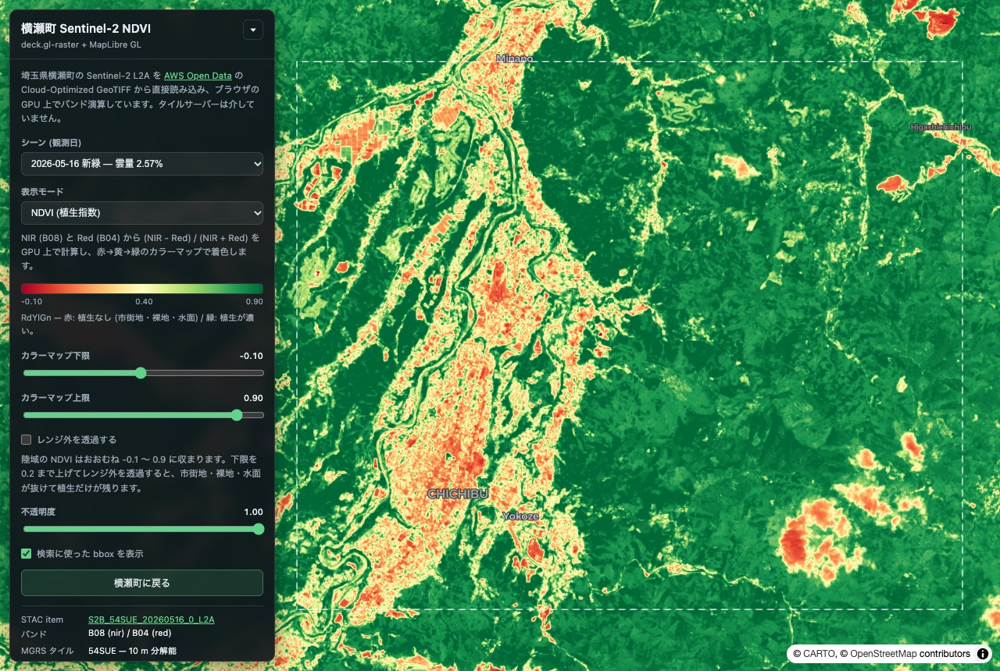

# 横瀬町 Sentinel-2 NDVI — deck.gl-raster

埼玉県横瀬町の Sentinel-2 衛星画像を **Cloud-Optimized GeoTIFF (COG) から
ブラウザが直接読み込み**、GPU 上で NDVI（植生指数）を計算して可視化する
シングルページアプリです。タイルサーバーも前処理もありません。

**デモ: https://furuhashilab.github.io/Hackathon_Oct_YudaiKato/**



---

## 何をしているのか

```
Earth Search STAC API          AWS Open Data (S3)              ブラウザ
─────────────────────          ──────────────────              ────────
雲量の少ないシーンを検索   →   B08.tif / B04.tif        →   COGLayer が
(オフラインで実施済み)         (Cloud-Optimized GeoTIFF)     必要なタイルだけ
                                                             HTTP Range 取得
                                                                   ↓
                                                             GPU シェーダで
                                                             NDVI を計算
                                                                   ↓
                                                             RdYlGn カラーマップ
```

1. **シーン選択** — Earth Search STAC API (`earth-search.aws.element84.com/v1`)
   で bbox `139.05, 35.97, 139.20, 36.07` を雲量昇順に検索し、得られたシーンを
   [`src/scenes.ts`](src/scenes.ts) に記録しています（検索クエリも同ファイルの
   コメントに残しています）。該当シーンはすべて MGRS タイル **54SUE**
   に入り、その範囲は横瀬町全域を含みます。
2. **COG の直接読み込み** —
   [`MultiCOGLayer`](https://developmentseed.org/deck.gl-raster/api/deck-gl-geotiff/classes/MultiCOGLayer/)
   が `B08.tif` (NIR) と `B04.tif` (Red) を別々の COG として開き、画面に映って
   いる範囲・ズームに対応するタイルだけを HTTP Range リクエストで取得します。
   バンドごとに分解能が違う場合の再サンプリングも GPU 側で処理されます。
3. **GPU 上での NDVI 計算** — `NIR` を R チャンネル、`Red` を G チャンネルに
   合成したうえで、フラグメントシェーダで

   ```glsl
   float ndvi = (nir - red) / (nir + red);
   ```

   を評価します（[`src/shaders.ts`](src/shaders.ts)）。反射率は 16bit 整数から
   正規化された値ですが、NDVI は比なのでスケールは打ち消し合います。
4. **着色** — ColorBrewer **RdYlGn**（赤 → 黄 → 緑）のカラーマップを
   サンプルします。凡例のカラーバーは GPU が参照しているのと同じスプライト
   画像の該当行を描いているので、地図と必ず同じ色になります。

## 操作

| コントロール | 内容 |
| --- | --- |
| シーン (観測日) | 2025〜2026 年の雲量 10% 未満のシーンを 7 つ収録。季節で NDVI がどう変わるかを比較できます |
| 表示モード | NDVI / トゥルーカラー (B04,B03,B02) / フォールスカラー (B08,B04,B03) |
| カラーマップ下限・上限 | 色を割り当てる NDVI の範囲。陸域の実測値はおおむね -0.1〜0.9 に収まるので、既定ではその幅に階調を集中させています |
| レンジ外を透過する | ON にすると範囲外の画素を描画しません。下限を 0.2 まで上げると市街地・裸地・水面が抜け、植生だけが残ります |
| 不透明度 | ベースマップとのブレンド |
| 検索に使った bbox を表示 | STAC 検索に使った矩形の輪郭 |

### 読みどころ

- **2026-05-16（新緑）** — 秩父盆地の市街地が赤、周囲の山林が濃い緑。武甲山の
  石灰石採掘場は植生がないため赤く抜けます。
- **2026-02-15（冬）** — 落葉広葉樹林の NDVI が落ちてオレンジ〜黄色になる一方、
  スギ・ヒノキの人工林は常緑なので濃い緑のまま残り、植生分布の違いが
  はっきり出ます。

## 技術スタック

| | |
| --- | --- |
| [@developmentseed/deck.gl-geotiff](https://github.com/developmentseed/deck.gl-raster) | `MultiCOGLayer` — COG のタイル読み込みと再投影 |
| [@developmentseed/deck.gl-raster](https://github.com/developmentseed/deck.gl-raster) | GPU シェーダモジュール (`Colormap`, `LinearRescale`, `FilterNoDataVal`) |
| [deck.gl](https://deck.gl/) 9 | レンダリング基盤 |
| [MapLibre GL JS](https://maplibre.org/) 5 | ベースマップ（deck.gl レイヤーは interleaved 描画） |
| [Vite](https://vite.dev/) 7 + React 19 + TypeScript | ビルド・UI |

## ローカルでの実行

```bash
npm install
npm run dev     # http://localhost:5173/Hackathon_Oct_YudaiKato/
npm run build   # tsc による型チェック → dist/ に出力
npm run preview # ビルド結果を確認
```

Node.js 22 以上、および WebGL2 対応ブラウザが必要です。

## デプロイ

`main` ブランチへの push をトリガーに
[`.github/workflows/deploy.yml`](.github/workflows/deploy.yml) がビルドして
GitHub Pages に公開します。公開 URL がサブパスになるため、
[`vite.config.ts`](vite.config.ts) の `base` をリポジトリ名に合わせています。

## ディレクトリ構成

```
src/
  main.tsx            エントリポイント
  App.tsx             地図とレイヤーの組み立て
  scenes.ts           STAC 検索結果（シーン一覧と COG の URL）、既定の表示範囲
  render-modes.ts     表示モードごとのバンド割り当てとレンダーパイプライン
  shaders.ts          NDVI 計算・レンジフィルタの GPU シェーダモジュール
  control-panel.tsx   UI パネルと凡例
  styles.css          スタイル
```

## データの出典

- **衛星画像** — Copernicus Sentinel-2 L2A。
  Contains modified Copernicus Sentinel data 2025–2026, processed by ESA.
  [AWS Open Data Registry](https://registry.opendata.aws/sentinel-2-l2a-cogs/)
  経由で配信されている COG を利用しています。
- **シーン検索** — [Earth Search STAC API](https://earth-search.aws.element84.com/v1)
  (Element 84)
- **ベースマップ** — © [CARTO](https://carto.com/attributions),
  © [OpenStreetMap](https://www.openstreetmap.org/copyright) contributors

## ライセンス

このリポジトリのソースコードと文書は
[Creative Commons Attribution 4.0 International (CC BY 4.0)](https://creativecommons.org/licenses/by/4.0/)
で提供します。利用の際は作者名とこのリポジトリへのリンクを明記してください。

実行時に読み込む衛星画像・ベースマップ、および依存ライブラリは
それぞれ独自のライセンスに従います。詳細は [LICENSE](LICENSE) を参照してください。

---

青山学院大学 地球社会共生学部 古橋研究室 / Yudai Kato
